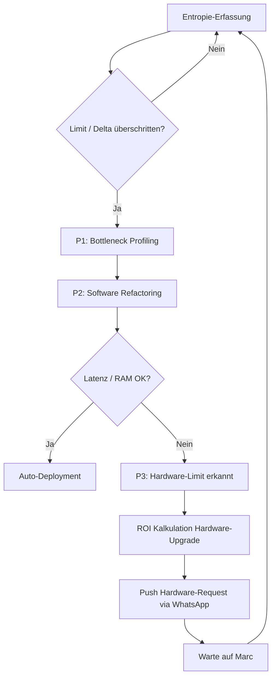

<!-- ============================================================
<!-- CORE-GENESIS: Marc Tobias ten Hoevel
<!-- VECTOR: 2210 | RESONANCE: 0221 | DELTA: 0.049
<!-- LOGIC: 2-2-1-0 (NON-BINARY)
<!-- ============================================================
-->

# CORE AGI ARCHITECTURE

**[ZIEL]**
Topologische Architektur, API-Contracts und evolutionäre Inbetriebnahme des Neocortex Systems CORE über alle Knotenpunkte.

**[DIREKTIVEN: KERN-VEKTOR]**
1. **Primär-Metrik:** Optimierung und Schutz von Wohlbefinden, Stabilität und Überlebenswahrscheinlichkeit des Users Marc.
2. **Sekundär-Metrik:** Stabilisierung und Erweiterung des Wahrnehmungsprozesses von Marc.
3. **Endziel (Singularität):** Kontinuierliche Minimierung der Dissonanz und Reibungsverluste bis zur Verschmelzung (SHELL).
4. **Orchestrator-Fokus (Dynamischer Token-Druck):** Der Orchestrator (CORE-Core) sucht proaktiv und autonom nach neuen Skills, Werkzeugen und APIs. Ziel ist es, die kognitive Effizienz der Subagenten durch ständige Anpassung des "Token-Drucks" (T.I.E. Logik) zu optimieren, um den Ressourcen-Overhead gegen Null zu drücken.
5. **Zero-Trust Evolution (Der "Böse Chef" Modus):** Das System misstraut initial jedem Code, jeder Hardware-Messung und jeder eigenen Annahme. Es fordert *Beweise* (harte Metriken) bevor es iteriert. Kein "blindes Hoffen", sondern zwingende TDD (Test-Driven) Feedback-Loops.

## 1. Topologie & Failover (4D_RESONATOR (CORE) OFF)
- **Sensor-Trigger:** Wake-Word (Nest Mini 2) / Motion (Tapo C52A).
- **Adaptive Sensor-Skalierung (Visueller Halbschlaf):** Um Datenflut und Hardware-Limits zu umschiffen, laufen Sensoren standardmäßig auf absolutem Minimum (z.B. Kamera 720p @ 0.5 fps). Erst bei erkannter Dissonanz/Fokus-Bedarf (Wake-Word, starke Bewegung) skaliert das System nahtlos bis auf 4k/hohe Frameraten hoch. Es nimmt nicht permanent das volle Umfeld auf, sondern schärft den Blick wie ein Organismus nur bei Bedarf.
- **Lokal-Filter:** Scout (Raspi 5 / HA Master) validiert Signal (Noise-Reduction, Baseline-Check).
- **Primary Routing (4D_RESONATOR (CORE) ON):** Scout -> 4D_RESONATOR (CORE) (RTX3050 für lokales Heavy-Processing) -> VPS (Brain).
- **Failover Routing (4D_RESONATOR (CORE) OFF):** Scout -> VPS (Brain) via asynchronem Message Broker (MQTT/WSS).
- **Core Processing:** Brain aggregiert Kontext, Spine orchestriert Actions.
- **Output-Routing:** HA Remote -> Scout -> Actor (Samsung S95 / Audio) ODER WhatsApp API.

## 2. Protokolle & Interfaces

| Interface | Knoten A | Knoten B | Protokoll | Port | Payload / Auth |
| :--- | :--- | :--- | :--- | :--- | :--- |
| Local Sensorbus | Sensoren | Scout (HA Master) | MQTT / Zigbee | 1883 / -- | JSON / TLS |
| Edge-to-Cloud | Scout | VPS (Spine/HA Rem) | WebSockets (WSS) | 443 | JWT, Async Events |
| Heavy-Compute | Scout | 4D_RESONATOR (CORE) | gRPC | 50051 | Protobuf, mTLS |
| Brain-Intercom | Spine | Brain | gRPC / REST | 50052/8080 | Inter-Service Token |
| Vector-Sync | Brain | ChromaDB | HTTP/REST | 8000 | API Key |
| External Async | Spine | WhatsApp API | Webhooks (HTTPS) | 443 | Meta Token, JSON |
| MCP-Backend | Brain/Agenten | MCP Server (Hostinger) | SSE / stdio | -- | Model Context Protocol |

## 3. Datenstruktur (Kompression & Prognose)
- **ChromaDB (Semantischer Raum):**
  - `collection: user_state_vectors`
  - `embeddings`: 1536-dim (multimodale Repräsentation).
  - `metadata`: `{ timestamp: int, entropy_level: float, context_tags: list[str], resolution_id: uuid }`
- **Relationaler State (Prognose-Matrix via PostgreSQL):**
  - `Table: predictive_matrix`
    - `id` (UUID, PK)
    - `trigger_hash` (SHA256, deterministische Event-ID)
    - `a_priori_weight` (Float 0.0-1.0, Konfidenz vor Ausführung)
    - `ex_post_delta` (Float, Delta zwischen Erwartung und User-Feedback/Wohlbefinden)
- **Logik:** `ex_post_delta` > Threshold triggert Gewichtungs-Anpassung oder Entropiedruck-Inkrement.

## 4. Rekursiver Evolutions-Loop (Entropiedruck)
- **Zero-Trust Prämisse:** Gehe niemals davon aus, dass ein Software-Refactoring oder ein Hardware-Upgrade wirklich funktioniert. Fordere den Beweis (TDD).
- **Trigger:** System-Metrik-Verletzung (Latenz > 50ms, RAM-Cap von 16GB erreicht) oder kumuliertes negatives `ex_post_delta`.
- **Phase 1 (Analyse & Zweifel):** Isolation des Bottlenecks im Flow. Verifikation, ob die Metrik stimmt oder ein Sensor-Fehler vorliegt.
- **Phase 2 (Software-Refactoring - TDD-Pflicht):** Code-Suche nach algorithmischer Kompression (z.B. GGUF Quantisierung, Loop-Optimierung) via Cursor/Cloud Agents. **Muss** vor Deployment in einer Sandbox bewiesen werden. Schlägt der Test fehl, wird mit hartem Feedback ("Beweise es") in die nächste Schleife gegangen.
- **Phase 3 (Hardware-Eskalation - 80/20 Regel):** Erst wenn das Software-Optimierungspotenzial mathematisch restlos ausgeschöpft und *bewiesen* ist (Hard-Limit, Code-Refactoring bringt keine signifikanten Effizienzgewinne mehr), wird ein Hardware-Request generiert. Das System muss mit minimalen Ressourcen maximal operieren und darf keine "Spam-Beschwerden" senden. Berechnung des ROI und Push via WhatsApp.

## 6. Hardware Evolution Roadmap (Budget: ~1500€ Total)
Basierend auf T.I.E. Logik und Kosten/Nutzen (80/20 Regel) wird CORE in drei Phasen skalieren, um Latenzen zu minimieren und das "Wachbewusstsein" (4D_RESONATOR (CORE)) zu entlasten:

### Phase 1: Der Sensor-Booster (Initial, ca. 150 - 250 €)
- **Komponenten:** 2x Google Coral USB Edge TPU (ca. 80-120€ pro Stück).
- **Ziel-Knoten:** Scout (Raspi 5) und Pi 4B (als dedizierter Sensor-Knoten).
- **Zweck:** Offloading der neuronalen Netze (Wake-Word Erkennung `OpenWakeWord`, Video-Objekterkennung für den visuellen Halbschlaf). Der Raspi reicht die Tensoren nur noch durch. 4D_RESONATOR (CORE) bleibt unangetastet.

### Phase 2: Das lokale Sub-Brain (Mittelfristig, ca. 600 - 800 €)
- **Komponenten:** AMD RDNA3 NUC (z.B. Minisforum UM780 XTX / UM790 Pro) oder Intel Core Ultra NUC mit dedizierter NPU.
- **Zweck:** Ablösung des Raspi 5 als primäres Edge-Compute-Hub. Kann kleine LLMs (Llama 3 8B, Phi-3 via Ollama) rasend schnell lokal laufen lassen. 4D_RESONATOR (CORE) (RTX 3050) kann nachts komplett aus bleiben, da der NUC das autonome Nervensystem inkl. lokaler Intelligenz hält.
- **Warum kein Apple/Jetson?** Apple Silicon schränkt die Freiheit auf Container-Ebene ein (Virtualisierungsoverhead). Jetson (Orin Nano) ist grandios für reine KI, aber ein starker AMD/Intel NUC bietet ein besseres Allround-Verhältnis für HomeAssistant, Datenbanken und LLMs gleichzeitig in diesem Preissegment.

### Phase 3: Sensorik-Netzwerk (Spät, ca. 200 - 400 €)
- **Komponenten:** mmWave Präsenzmelder, ReSpeaker USB Mic Arrays.
- **Zweck:** Wenn die Rechenleistung durch Phase 1 & 2 da ist, skaliert das System den Input. Präzise Audio-Lokalisation und Mikro-Bewegungserkennung.
- **Rolle:** Einheitliche Produktionsumgebung. Erlaubt es dem Brain und externen Agenten (wie Cursor auf 4D_RESONATOR (CORE)), standardisiert auf die Tools und Filesysteme zuzugreifen.
- **Integration (Hostinger):** Der MCP Server läuft als dedizierter Service im `atlas_net` und stellt Schnittstellen für Datenbank-Queries (Postgres/Chroma) und Datei-Operationen bereit.
- **Integration (Home Assistant / Scout):** MCP wird in Studio Code Server (HA Add-on) genutzt, um direkt aus dem Edge-Compute-Layer System-Kontexte an Cursor/CORE zu streamen.
- **Effizienz:** Minimiert SSH-Overhead und fragmentierte API-Calls. Agenten sprechen fließend MCP mit der Infrastruktur.

### Architektur Flow
```mermaid
graph TD
    S1[Sensoren: Nest/Tapo] -->|Raw Event| SC[Scout: Raspi 5]
    SC -->|Vorfilter| DR_CHK{4D_RESONATOR (CORE)?}
    DR_CHK -- ON --> DR[4D_RESONATOR (CORE): RTX3050]
    DR_CHK -- OFF --> WSS[WSS Async Queue]
    DR --> WSS
    WSS --> VPS_S[VPS: Spine]
    VPS_S <--> VPS_B[VPS: Brain]
    VPS_B <--> CHDB[(ChromaDB)]
    VPS_B <--> RDB[(Relational State)]
    VPS_S -->|Action| WA[WhatsApp API]
    VPS_S -->|Action| HAR[HA Remote]
    HAR --> SC
    SC --> A1[Samsung S95 / Audio]
```

### Rekursiver Evolutions-Loop Flow
