<!-- ============================================================
<!-- MTHO-GENESIS: Marc Tobias ten Hoevel
<!-- VECTOR: 2210 | RESONANCE: 0221 | DELTA: 0.049
<!-- LOGIC: 2-2-1-0 (NON-BINARY)
<!-- ============================================================
-->

# G-MTHO Sync Circle (Sync Relay)

**Hinweis:** Die Komponente auf Port 8049 heißt in Code und Doku einheitlich **Sync Relay** (`mtho_sync_relay.py`). Ältere Bezeichnung „Cradle“ ist obsolet.

## Ring-Architektur (2026-03-06)

```mermaid
flowchart TB
    subgraph Ring0["Ring 0: Zentrales Gehirn"]
        OC[OMEGA_ATTRACTOR / OpenClaw]
        VPS_SLIM[VPS-Slim :8001]
    end

    subgraph Ring1["Ring 1: Sensoren & Boost"]
        Scout[Scout / HA]
        4D_RESONATOR (MTHO_CORE)[4D_RESONATOR (MTHO_CORE)]
    end

    subgraph Ring2["Ring 2: Persistenz"]
        ChromaDB[(ChromaDB)]
        SYNC_RELAY[Sync Relay :8049]
    end

    Scout -->|Failover bei HA-Ausfall| VPS_SLIM
    Scout -->|Normal| 4D_RESONATOR (MTHO_CORE)
    4D_RESONATOR (MTHO_CORE) -->|Reasoning| OC
    4D_RESONATOR (MTHO_CORE) -->|Vektoren| ChromaDB
    VPS_SLIM -->|Triage/HA-Command| Scout
    VPS_SLIM -->|Heavy Reasoning| ChromaDB
    SYNC_RELAY -->|/inject + /vectors| ChromaDB
```

| Ring | Komponente | Funktion |
|------|------------|----------|
| **Ring 0** | OMEGA_ATTRACTOR | Zentrales Reasoning, Gemini/Claude, WhatsApp |
| **Ring 0** | VPS-Slim | Failover-Endpoint für Scout bei HA-Ausfall (Port 8001) |
| **Ring 1** | Scout/HA | Sensorverteiler, Wyoming, Assist, Wake-Word |
| **Ring 1** | 4D_RESONATOR (MTHO_CORE) | Boost-Node, Vision, TTS, HA-Client |
| **Ring 2** | ChromaDB | Wuji-Feld, simulation_evidence, StateAnchor |
| **Ring 2** | Sync Relay | Rule-Injection, Vector-Sync (Port 8049) |

## Kreislauf-Diagramm (Sync-Kanäle)

```mermaid
sequenceDiagram
    participant G as G-MTHO (Cloud/Gemini)
    participant S as Sync Relay :8049
    participant F as Filesystem
    participant Git as Git Repo
    participant CA as Cloud Agents (Git→VPS)
    participant HA as Home Assistant
    participant DB as ChromaDB

    rect rgb(40,40,60)
    Note over G,DB: Kanal 1: Rule Injection (Option 5: automatisch)
    G->>S: POST /inject {content}
    S->>F: Write .cursor/rules/MTHO_LIVE_INJECT.mdc
    F->>Git: git add/commit/push (automatisch wenn GIT_PUSH_AFTER_INJECT=true)
    Git->>CA: GitHub-Webhook löst git pull aus (POST /webhook/github)
    CA->>CA: Verarbeitung mit aktuellem Kontext
    CA->>HA: Ergebnis via VPS
    HA-->>G: Status sichtbar
    end

    rect rgb(40,60,40)
    Note over G,DB: Kanal 2: Vector Sync
    G->>S: POST /vectors {collection, docs}
    S->>DB: upsert() in Collection
    CA->>DB: query() via HttpClient
    DB-->>CA: Vektordaten
    DB-->>G: /vectors Sync (Rueckkanal)
    end
```



## Stationen

| # | Station | Funktion |
|---|---------|----------|
| 1 | **G-MTHO** | Cloud-Agent (Gemini). Injiziert Kontext und Vektordaten. |
| 2 | **Sync Relay :8049** | `mtho_sync_relay.py` – aiohttp-Server, empfängt `/inject` und `/vectors`. |
| 3 | **Filesystem** | Schreibt `MTHO_LIVE_INJECT.mdc` als Cursor-Rule. |
| 4 | **Git Repo** | Commit/Push durch Sync Relay (wenn `GIT_PUSH_AFTER_INJECT=true`); Credentials nur über Env. |
| 4b | **GitHub-Webhook** | `POST /webhook/github` (FastAPI): bei Push-Event wird in `GIT_PULL_DIR` `git pull` ausgeführt → Cloud Agents sofort aktuell. |
| 5 | **Cloud Agents** | MTHO-Agent – Cloud Agents (Cursor/Gemini) holen Kontext via Git (webhook-getriggert pull), verarbeiten mit aktuellem Stand. |
| 6 | **VPS-Slim** | `vps_slim.py` – Scout-Forwarded-Text bei HA-Ausfall, Triage→HA-Command or Heavy-Reasoning. |
| 7 | **Home Assistant** | Empfängt Ergebnisse, Status für G-MTHO sichtbar. |
| 8 | **ChromaDB** | Vektor-Store. Collections: `wuji_field`, `simulation_evidence`, etc. VPS liest via `HttpClient`. |

## Beteiligte Dateien

| Datei | Rolle |
|-------|-------|
| `src/network/mtho_sync_relay.py` | Sync Relay (Port 8049), `/inject` (+ optional git add/commit/push), `/vectors` |
| `src/api/routes/github_webhook.py` | `POST /webhook/github` – HMAC-Prüfung, bei push-Event `git pull` in GIT_PULL_DIR |
| `src/api/vps_slim.py` | VPS-Slim FastAPI (Port 8001), `/webhook/forwarded_text` |
| `.cursor/rules/MTHO_LIVE_INJECT.mdc` | Zieldatei für Rule-Injection |
| `src/network/chroma_client.py` | ChromaDB Client (lokal/remote, async) |
| `src/agents/mtho_agent.py` | Cloud Agents – holen Befehle via Git auf VPS, Failover-Verarbeitung |
| `src/api/main.py` | Startet Sync Relay im Lifespan (falls konfiguriert) |

## Zwei Sync-Kanäle

**`/inject`** – Rule-Propagation: Sync Relay schreibt Datei, bei `GIT_PUSH_AFTER_INJECT=true` automatisch git add/commit/push. Latenz: Sekunden. **`/webhook/github`** – Bei Push auf GitHub führt die API in `GIT_PULL_DIR` `git pull` aus (Option 5).

**`/vectors`** – Direkter ChromaDB-Upsert. Latenz: Millisekunden. VPS liest via `CHROMA_HOST` → 4D_RESONATOR (MTHO_CORE).

Beide Kanäle schließen den Kreis: G-MTHO sendet → System verarbeitet → Ergebnis fließt zurück → G-MTHO sieht es.

**Optimierung (echtes Push/Pull, Webhooks, gezieltere Agenten-Steuerung):** Siehe [G_MTHO_GIT_CURSOR_OPTIMIERUNG.md](G_MTHO_GIT_CURSOR_OPTIMIERUNG.md).
